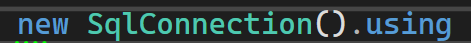
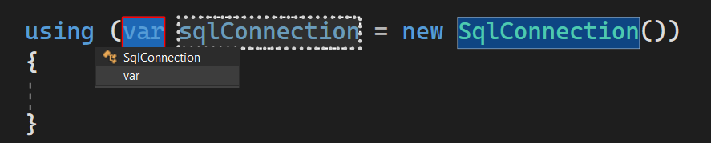
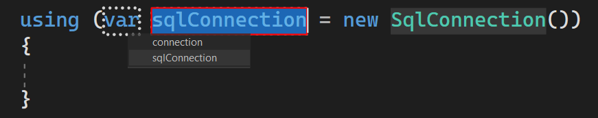
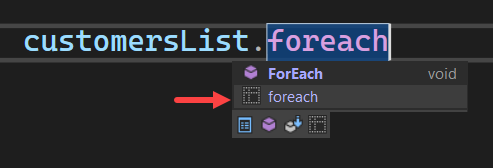
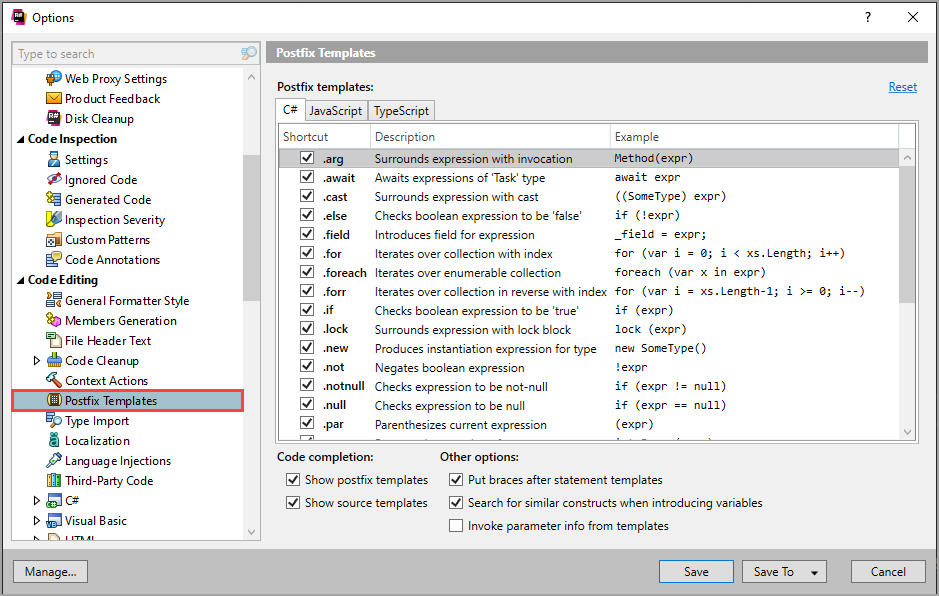
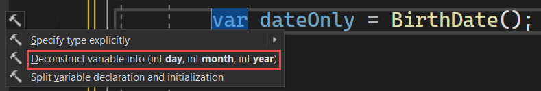
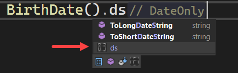
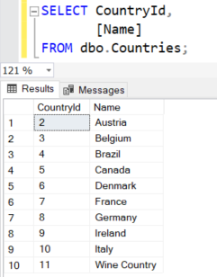
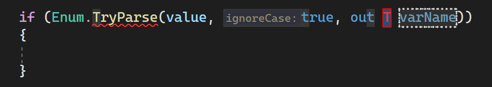

# Learn Resharper PostFix and Source Templates

In this article learn how to create and use Jetbrains ReSharper’s [Source templates](https://www.jetbrains.com/help/resharper/Source_Templates.html) and to explore [Postfix templates](https://www.jetbrains.com/help/resharper/2023.1/Reference__Options__Environment__Postfix_Templates.html).

> **Note**
> All source templates presented are in the GitHub repository


## Postfix templates

With these templates a developer can write less code in many cases.

Simple example, we want to write the following code which without Postfix templates everything needs to be hand typed.

```csharp
using (var cn = new SqlConnection())
{
    
}
```

### With PostFix templates type

**Working with SqlClient**

```csharp
new SqlConnection()
```

Next type `using` and press <kbd>Enter</kbd> 



After pressing <kbd>Enter</kbd> there is a prompt to use `var` or the type, use <kbd>Up</kbd> and  <kbd>Down</kbd> arrows to select.



Press <kbd>TAB</kbd> and name choices appear, use <kbd>Up</kbd> and  <kbd>Down</kbd> arrows to select or type in your own name.

.

**Create a foreach**

The task is to iterate data read from a file using a foreach which should look like the following.

```csharp
List<Customers> customersList =
    JsonSerializer.Deserialize<List<Customers>>(
        File.ReadAllText("Customers.json"));

foreach (var customer in customersList!)
{
    Console.WriteLine($"{customer.Id,-3}{customer.Company}");
}
```

:small_blue_diamond: Step 1, create the model.

```csharp
public class Customers
{
    public int Id { get; set; }
    public string Company { get; set; }
    public string Title { get; set; }
    public string Contact { get; set; }
    public string Country { get; set; }
    public string Phone { get; set; }
    public DateTime Modified { get; set; }
}
```

:small_blue_diamond: Step 2, read the file

```csharp
List<Customers> customersList =
    JsonSerializer.Deserialize<List<Customers>>(
        File.ReadAllText("Customers.json"));
```

Type the variable name, <kbd>.</kbd> then **foreach** (no upper casing) and press <kbd>Enter</kbd>

 

to get a prompt same as last example for var or type then variable name.

### PostFix templates list

See the following [documentaton](https://www.jetbrains.com/help/resharper/2023.1/Reference__Options__Environment__Postfix_Templates.html#code-completion) for a list of postfix templates.

Also, under Resharper options they are listed and can be turned off.



## Source templates

These templates are really cool to create your own postfix templates were the template is for a specific project or solution as per [documentation](https://www.jetbrains.com/help/resharper/Source_Templates.html). Templates can be created in the same project they will be used in or create a Visual Studio solution for source templates only and reference the class project into your projects.

### Working with DateTime, DateOnly and TimeOnly

The task is to get parts for a DateOnly.

Our source

```csharp
static DateOnly BirthDate() 
    => new(2022, 9, 2);
```

Extract Month, Day and Year

```csharp
var dateOnly = BirthDate();
var month = dateOnly.Day;
var year = dateOnly.Year;
var day = dateOnly.Day;
```

Or we can [Deconstruct](https://learn.microsoft.com/en-us/dotnet/csharp/fundamentals/functional/deconstruct) were after typing `var dateOnly = BirthDate();` 



Which is possible using the following method incuded in SourceTemplateLibrary class project along with other similar methods.

After accepting

```csharp
var (day, month, year) = BirthDate();
```

Code For BirthDate()

```csharp
static DateOnly BirthDate() 
    => new(2022, 9, 2);
```

To create the above with a source template.

- Create a static class
- Add the following NuGet package [JetBrains.Annotations](https://www.nuget.org/packages/JetBrains.Annotations/2023.2.0?_src=template)
- Create the following extension method

```csharp
[SourceTemplate]
public static void ds(this DateTime sender)
{
    var (day, month, year) = sender;
}
```

- Builds the project
- Type **BirthDate()** for this example follows bs `ds`, press <kbd>Enter</kbd>



And Resharper provides

```csharp
var (day, month, year) = BirthDate();
```

Let's say you don't need one of the parts, use a [discard](https://learn.microsoft.com/en-us/dotnet/csharp/fundamentals/functional/discards).

```csharp
var (day, _, year) = BirthDate();
```

The same can be done for a TimeOnly, create the following extension method.

```csharp
public static class TimeOnlyExtensions
{
    public static void Deconstruct(this TimeOnly time, out int hour, out int minutes, out int seconds, out int milliseconds)
        => (hour, minutes, seconds, milliseconds) = 
            (time.Hour, time.Minute, time.Second, time.Microsecond);
}
```

Create the source template in a static class

```csharp
[SourceTemplate]
public static void ds(this TimeOnly sender)
{
    var (hour, minutes, seconds, milliseconds) = sender;
}
```

> **Note**
> Two things, Reshaper uses lower casing for source templates which is done here, secondly, the names were kept simple ds for Deconstruct. Feel free to use different names that make sense to you.


Suppose there is a need to see if a DateTime is a weekday or weekend.

Create the following class for logic to see if a date is a weekday or weekend.

```csharp
public static class DateTimeExtensions
{
    public static bool IsWeekend(this DateTime self) 
        => self.DayOfWeek is DayOfWeek.Sunday or DayOfWeek.Saturday;

    public static bool IsWeekDay(this DateTime self)
        => !self.IsWeekend();

    public static bool IsWeekDay(this DayOfWeek sender)
    {
        return sender is DayOfWeek.Monday or 
            DayOfWeek.Tuesday or 
            DayOfWeek.Wednesday or 
            DayOfWeek.Thursday or 
            DayOfWeek.Friday;
    }

    public static bool IsWeekend(this DayOfWeek sender) => !sender.IsWeekDay();
}
```
Create the source template in a static class. Note **//$ $END$** which is the final cursor position.

```csharp
[SourceTemplate]
public static void weekday(this DateTime sender)
{
    if (sender.IsWeekDay())
    {
        //$ $END$
    }
}
```

Now to iterate a list of DateTime the final results for this code sample will be...

```csharp
var dates = DateTimesList();

foreach (var date in dates)
{
    if (date.IsWeekDay())
    {
        Console.WriteLine(date.DayOfWeek);
    }
}
```

With the following source

```csharp
private static List<DateTime> DateTimesList()
    => Enumerable.Range(1, 7)
        .Select(day => new DateTime(2023, 7, day))
        .ToList();
```

Once the following has been entered

```csharp
var dates = DateTimesList();
```

Type dates `dates.foreach` and press <kbd>Enter</kbd> to use the built in postfix template. We get the following.


```csharp
foreach (var dateTime in dates)
{
    
}
```

Place the cursor in the body of the `foreach` and type the following to use the custom source template.

```csharp
dateTime.weekday
```

Press <kbd>Enter</kbd>  or <kbd>TAB</kbd> and the following is written.

```csharp
foreach (var dateTime in dates)
{
    if (dateTime.IsWeekDay())
    {
        
    }
}
```

## Working with a data provider DataReader

In this example the task is to iterate a [SqlDataReader](https://learn.microsoft.com/en-us/dotnet/api/system.data.sqlclient.sqldatareader?view=dotnet-plat-ext-7.0) from a [SqlCommand](https://learn.microsoft.com/en-us/dotnet/api/system.data.sqlclient.sqlcommand?view=dotnet-plat-ext-7.0).

:small_orange_diamond: Desired finished code

```csharp
var statement = "SELECT CountryId, [Name] FROM dbo.Countries;";
var connectionString = _configuration.GetValue<string>("ConnectionStrings:ApplicationConnection");
using SqlConnection cn = new(connectionString);
using SqlCommand cmd = new(statement, cn);
try
{
    cn.Open();
    SqlDataReader? reader = cmd.ExecuteReader();
    while (reader.Read())
    {
        
    }
}
catch (Exception exception)
{
    Console.WriteLine(exception.Message);
}
```

Even if the developer types fast with source templates the above code can be in about 20 seconds or less.


This example is done in a Console project so there are several NuGet packages needed. Open the project file and note packages starting with `Microsoft.Extensions`.

The connection string is in appsettings.json

```json
{
  "Logging": {
    "LogLevel": {
      "Default": "Information",
      "Microsoft.AspNetCore": "Warning"
    }
  },
  "AllowedHosts": "*",
  "ConnectionStrings": {
    "ApplicationConnection": "Data Source=.\\SQLEXPRESS;Initial Catalog=EF.UsingInterfaces;Integrated Security=True;Encrypt=False"
  }
}
```

Add the following variable for getting the connection string

```csharp
private static IConfiguration? _configuration;
```

Now lets use one standard postfix template and two custom source templates.

Data to read



Create the following method

```csharp
static void SqlClientExample()
{
    var statement = "SELECT CountryId, [Name] FROM dbo.Countries;";
    
}
```

Under `var statment` type the following and press <kbd>Enter</kbd> 

```csharp
new SqlConnection().create
```

Which writes out the following

```csharp
static void SqlClientExample()
{
    var statement = "SELECT CountryId, [Name] FROM dbo.Countries;";

    var connectionString = _configuration.GetValue<string>("ConnectionStrings:ApplicationConnection");
    using SqlConnection cn = new(connectionString);
    using SqlCommand cmd = new("statement", cn);
    try
    {
        cn.Open();
            
    }
    catch (Exception exception)
    {
        Console.WriteLine(exception.Message);
    }
}
```

Remove the quotes on statement

```csharp
using SqlCommand cmd = new(statement, cn);
```

Under `cn.Open()` type the following and press <kbd>Enter</kbd> 

```csharp
cmd.reader
```

Which writes out a variale for a SqlDataReader and a while statement as follows.

```csharp
static void SqlClientExample()
{
    var statement = "SELECT CountryId, [Name] FROM dbo.Countries;";

    var connectionString = _configuration.GetValue<string>("ConnectionStrings:ApplicationConnection");
    using SqlConnection cn = new(connectionString);
    using SqlCommand cmd = new(statement, cn);
    try
    {
        cn.Open();
        SqlDataReader? reader = cmd.ExecuteReader();
        while (reader.Read())
        {
                
        }
            
    }
    catch (Exception exception)
    {
        Console.WriteLine(exception.Message);
    }
}
```

Add a line to read out data to the console and run the code.

```csharp
while (reader.Read())
{
    Console.WriteLine($"{reader.GetInt32(0),-3}{reader.GetString(1)}"); 
}
```

## Razor Pages/ASP.NET Core

To get a connection string for EF Core in Program.cs this is one method.

```csharp
builder.Services.AddDbContext<Context>(options =>
    options.UseSqlServer(builder.Configuration.GetConnectionString("ApplicationConnection"))
        .EnableSensitiveDataLogging());
```

The following is only here to show how to create a source template for a [DbContext](https://learn.microsoft.com/en-us/dotnet/api/system.data.entity.dbcontext?view=entity-framework-6.2.0).

Create the following class where source templates reside.

```csharp
internal class Context : DbContext
{
}
```

> **Note**
> In this case your DbContext is named Context, change it for the DbContext used in your project.


Now the following source templates can be used.

```csharp
public static class AspNetCoreTemplates
{
    [SourceTemplate]
    public static void connectstring(this WebApplicationBuilder builder)
    {
        var connectionString = builder.Configuration.GetConnectionString("ApplicationConnection");
    }

    [SourceTemplate]
    public static void connectionpool(this WebApplicationBuilder builder)
    {
        builder.Services.AddDbContextPool<Context>(options =>
            options.UseSqlServer(
                builder.Configuration.GetConnectionString("ApplicationConnection")));
    }

    [SourceTemplate]
    public static void connection(this WebApplicationBuilder builder)
    {
        builder.Services.AddDbContext<Context>(options =>
            options.UseSqlServer(
                builder.Configuration
                    .GetConnectionString("ApplicationConnection")));
    }
}
```
In Program.cs type builder.connection and press <kbd>Enter</kbd> to write the following.

```csharp
public class Program
{
    public static void Main(string[] args)
    {
        var builder = WebApplication.CreateBuilder(args);

        builder.Services.AddDbContext<Context>(options =>
            options.UseSqlServer(
                builder.Configuration
                    .GetConnectionString("ApplicationConnection")));
```

## SqlClient SqlDataReader DateOnly TimeOnly

Using NuGet package Microsoft.Data.SqlClient version 5.1.1 (at the time of this article) its possible to return DateOnly and TimeOnly using SqlClient data provider.

First create several extension methods

```csharp
public static class SqlClientExtensions
{
    public static DateOnly GetDateOnly(this SqlDataReader reader, int index)
        => reader.GetFieldValue<DateOnly>(index);

    public static TimeOnly GetTimeOnly(this SqlDataReader reader, int index)
        => reader.GetFieldValue<TimeOnly>(index);
}
```

In a static class add the following source template

```csharp
[SourceTemplate]
[Macro(Target = "dto")]
public static void gdo(this SqlDataReader reader, int index)
{
    var dto = reader.GetDateOnly(index); 
}
```

Where there is a SqlDataReader type and press <kbd>Enter</kbd> 

```csharp
reader.gdo
```

The following is written, first prompting for a ordinal position in plac of **index**

```csharp
var dto = reader.GetDateOnly(index);
```

Enter the index, press <kbd>TAB</kbd> to optionally change the current variable name from dto to something useful.


## Simple generic Enum source template

Add the following method to a static class

```csharp
[SourceTemplate]
[Macro(Target = "T")]
[Macro(Target = "varName")]
public static void checker<T>(this string sender, T type) where T : struct
{
    if (Enum.TryParse(sender, true, out T varName))
    {
            
    }
}
```

When invoked

- There is a prompt for **T** to enter an enum
- Press <kbd>TAB</kbd> for a prompt for a out variable name

**Usage**

```csharp
public enum DemoEnum
{
    One,
    Two,
    Three
}
```

In your code add 

```csharp
var value = "one";
```

Type value.checker and the following is written



- Enter the type
- <kbd>TAB</kbd>
- Enter the variable name

```csharp
var value = "one";

if (Enum.TryParse(value, true, out DemoEnum result))
{

}
```

## Summary

With what has been presented a developer can use the source templates provided along with created their own templates along with knowledge that Postfix templates built into ReSharper can reduce coding time.

## Source code

Clone the following GitHub repository and run the script under ConsoleApp1 project in the Scripts folder.

## Article

https://dev.to/karenpayneoregon/learn-resharper-postfix-and-source-templates-32lo


